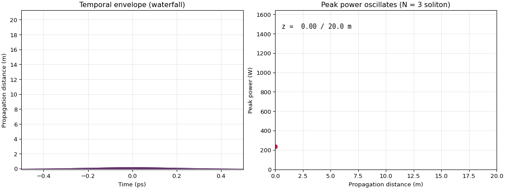

# Photonics Helper

A comprehensive helper library for photonics and optics calculations.

**Documentation:** <https://hitaishi2222.github.io/photonics_helper/>

---

## Installation

```bash
pip install photonics-helper
```

Optional extras: `fftw`, `plotting`, `webapp`, `extras`, `mode-export`, `pinns`.

---

## Key Features

- **Type Safety**: Full inline type hints (PEP 561 `py.typed`)
- **Unit Conversions**: Wavelength, frequency, angular frequency
- **Pulse Visualization**: Interactive 2D/3D pulse envelope plots
- **DBR Simulation**: Transfer Matrix Method for multilayer stacks
- **FROG**: SHG-FROG trace generation and PCGPA pulse retrieval
- **Raman Modeling**: Full Raman response physics for 40+ materials
- **GNLSE Engine**: Split-step Fourier solver for nonlinear propagation
- **Vector GNLSE**: Coupled two-polarization solver
- **Multimode GNLSE**: N coupled modal envelopes with inter-modal FWM
- **Inverse Design**: `fit_two_wave`, `design_efficiency`, `fit_shg_autodiff`
- **Breathers**: Exact analytic breather solutions
- **Solitons**: Soliton solutions and analysis
- **Noise**: Stochastic noise sources (ASE, Raman)
- **Validation**: Convergence studies and analytical checks

---

## Quick Start

```python
from photonics_helper import Wavelength

# Unit conversions
wl = Wavelength(1550, "nm")
freq = wl.to_freq()
omega = freq.to_omega()

print(f"λ = {wl.as_nm} nm")
print(f"f = {freq.as_THz} THz")
print(f"ω = {omega.as_rad_s:.4e} rad/s")
```

### GNLSE Propagation

Animated version of `examples/13_gnlse_soliton_evolution.py`: an N = 3 soliton
breathing and fissioning over one dispersion length.

```python
from photonics_helper import (
    Area,
    Length,
    Time,
    Wavelength,
    FiberProfile,
    GNLSESolver,
    Envelope,
    TemporalGrid,
    Wave,
)

import numpy as np
import matplotlib.pyplot as plt
from matplotlib import cm
from matplotlib.animation import FuncAnimation, PillowWriter

# Anomalous-dispersion fiber: β₂ = -2 ps²/km = -2e-3 ps²/m (engine units)
T0 = Time(200, "fs")
beta2 = -2.0e-3
n2, A_eff = 2.6e-20, Area(80, "um^2")
omega0 = 2 * np.pi * 299792458.0 / Wavelength(1064, "nm").as_m
gamma = n2 * omega0 / (299792458.0 * A_eff.as_m2)

# N = 1 soliton power for these parameters; N = 3 needs 9x the power
P0_N1 = abs(beta2 * 1e-24) / (gamma * T0.as_s**2)
L_D = Length(T0.as_s**2 / abs(beta2 * 1e-24), "m")

grid = TemporalGrid(N=2**11, Tmax=Time(5 * T0.as_fs * 1e-15, "s"))
pulse = Wave(
    grid=grid,
    envelope=Envelope(shape="sech", peak_amplitude=np.sqrt(9 * P0_N1), pulse_width=T0),
    central_wavelength=Wavelength(1064, "nm"),
).with_effective_area(A_eff)

solver = GNLSESolver(
    pulse=pulse,
    fiber=FiberProfile(n2=n2, alpha=0.0, A_eff=A_eff, length=L_D),
    betas=np.array([beta2]),  # [β₂, β₃, ...] in psᵏ/m
    include_raman=False,
    include_self_steepening=False,
)
solver.propagate(num_steps=100, show_progress=True)  # tqdm bar over z

# Animate: temporal-envelope waterfall + peak-power trace growing with z
t_ps = grid.t * 1e12
z_m = solver.z_array
peak = np.array(
    [float(np.max(np.abs(w.envelope_field)) ** 2) for w in solver.evolution]
)
colors = cm.viridis(np.linspace(0, 1, len(solver.evolution)))

OFF = 0.22  # vertical spacing between waterfall traces
fig, (ax_t, ax_p) = plt.subplots(1, 2, figsize=(12, 4.5), constrained_layout=True)
ax_t.set(
    xlim=(-0.5, 0.5),
    ylim=(-0.1, OFF * len(solver.evolution) + 1.15),
    xlabel="Time (ps)",
    ylabel="Propagation distance (m)",
    title="Temporal envelope (waterfall)",
)
ax_p.set(
    xlim=(0, z_m[-1]),
    ylim=(0, peak.max() * 1.15),
    xlabel="Propagation distance (m)",
    ylabel="Peak power (W)",
    title="Peak power oscillates (N = 3 soliton)",
)
for ax in (ax_t, ax_p):
    ax.grid(alpha=0.3)

(z_line,) = ax_p.plot([], [], color="crimson", lw=2.2)
(marker,) = ax_p.plot([], [], "o", color="crimson", ms=7)
label = ax_p.text(
    0.03, 0.92, "", transform=ax_p.transAxes, fontsize=11, family="monospace", va="top"
)


def draw(k):
    for j in range(k + 1):
        a = np.abs(solver.evolution[j].envelope_field)
        base = j * OFF
        # Filled bands, not thin lines: each trace fills its own slot, so the
        # stack has no white gaps between traces.
        ax_t.fill_between(
            t_ps, base, a / a.max() * OFF * 0.98 + base, color=colors[j], lw=0
        )
    ticks = np.arange(0, len(solver.evolution) * OFF, 10 * OFF)
    ax_t.set_yticks(ticks)
    ax_t.set_yticklabels([f"{z_m[int(v / OFF)]:.0f}" for v in ticks])
    z_line.set_data(z_m[: k + 1], peak[: k + 1])
    marker.set_data([z_m[k]], [peak[k]])
    label.set_text(f"z = {z_m[k]:5.2f} / {z_m[-1]:.1f} m")
    return z_line, marker, label


anim = FuncAnimation(fig, draw, frames=len(solver.evolution), interval=100)
anim.save("soliton_fission.gif", writer=PillowWriter(fps=12), dpi=95)
```

Output:



---

## Examples

See `examples/` for 43 runnable examples covering:

- Pulse visualization and FROG
- Raman response and material comparison
- GNLSE propagation (basic, soliton, Raman, steepening, TPA)
- Breather families and wave breaking
- Vector polarization and multimode GNLSE
- Noise, ASE, and Raman thermal floor
- Inverse design (QPM, FWM, autodiff)
- Material catalog query

---

## Reproductions

See `reproductions/` for literature reproductions (12 papers reproduced).

---

## Material Database

The SQLite material database (`materials.db`) ships with 44 materials,
39 Sellmeier equations, and 30 tabulated n/k datasets.
All 30 source keys are loadable through `RefractiveIndex.from_material_database`.

---

## Testing

```bash
python -m pytest tests/
```

---

## License

MIT
